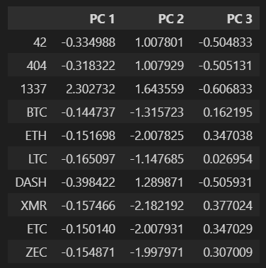

# Cryptocurrencies
Module 18

## Overview of Analysis:

A prominent investment bank, Accountability Accounting, is interested in creating an investment portfolio for crypotcurrency for thei customers.  They have asked us to create a report that includes which cryptocurrencies are available on the trading market and how they could be grouped to create a classification system for the new investment.  We will process the cryptocurrency data to fit the machine learning models, unsupervised learning.  We will be grouping the cryptocurrencies with a clustered algorithm and create a few visualizations for a presentation.

## Resources:

Software:  
VS Code version 1.59 
Python version 3.7.10 
 
Code:  
[cryto_clustering.ipynb](Challenge/crypto_clustering.ipynb)  

Images: 
[Images](Challenge/Images/)  

Data: 
[crypto_data.csv](Challenge/Resources/crypto_data.csv)  

## Results:

DataFrame Sample  
  

PCA DataFrame  
  

Elbow Curve  
  

Clustered DataFrame  
  

Scatter Plot 3D Chart 
  

Table  
  

Scaled Plot DataFrame  
  

Scatter Plot Chart  
  

